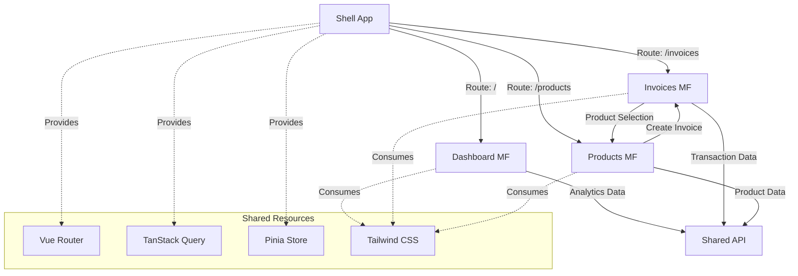

# 🚀 Trista - Microfrontend Business Management Platform

<div align="center">
  
  

  [](LICENSE)
  [](https://vuejs.org/)
  [](https://www.typescriptlang.org/)
  [](https://vitejs.dev/)
  [](https://pnpm.io/)
  [](https://webpack.js.org/concepts/module-federation/)

  **A modern, scalable microfrontend architecture replicating core business functions**
  
  *Inspired by Alegra's business model, built for the future*

</div>

## 📖 Table of Contents

- [🎯 Overview](#-overview)
- [🏗️ Architecture](#️-architecture)
- [🔥 Features](#-features)
- [🛠️ Technology Stack](#️-technology-stack)
- [📦 Project Structure](#-project-structure)
- [⚡ Quick Start](#-quick-start)
- [🚀 Development](#-development)
- [🏭 Production](#-production)
- [🔧 Configuration](#-configuration)
- [📊 Monitoring & Analytics](#-monitoring--analytics)
- [🤝 Contributing](#-contributing)
- [📄 License](#-license)

## 🎯 Overview

**Trista** is a cutting-edge microfrontend application that replicates the core business management functionality of companies like Alegra, but with a modern, simplified approach. Built with Vue 3 and Module Federation, it demonstrates how complex business applications can be architected using independently deployable microfrontends.

### 🎪 What makes Trista special?

- **🧩 Modular Architecture**: Each business domain is an independent microfrontend
- **🔄 Dynamic Loading**: Microfrontends are loaded on-demand with fallback support
- **🎨 Consistent UX**: Shared design system across all modules
- **📱 Modern Stack**: Built with the latest Vue 3, TypeScript, and Vite
- **🚀 Production Ready**: Deployed across multiple Vercel instances with intelligent routing

## 🏗️ Architecture

```
┌─────────────────────────────────────────────────────────────────┐
│                           TRISTA ECOSYSTEM                      │
├─────────────────────────────────────────────────────────────────┤
│                                                                 │
│  ┌─────────────────────────────────────────────────────────────┐│
│  │                    🏠 SHELL APPLICATION                     ││
│  │                    (Port: 5173)                            ││
│  │  ┌─────────────────────────────────────────────────────┐   ││
│  │  │     🧠 Central Orchestrator & Router               │   ││
│  │  │                                                     │   ││
│  │  │  • Module Federation Host                          │   ││
│  │  │  • Global Navigation & Layout                      │   ││
│  │  │  • Shared State Management (Pinia)                │   ││
│  │  │  • I18n Service Provider                           │   ││
│  │  │  • Authentication & Authorization                  │   ││
│  │  │                                                     │   ││
│  │  └─────────────────────────────────────────────────────┘   ││
│  └─────────────────────────────────────────────────────────────┘│
│                               │                                 │
│            ┌─────────────────┼─────────────────┐               │
│            │                 │                 │               │
│            ▼                 ▼                 ▼               │
│                                                                 │
│  ┌─────────────────┐ ┌─────────────────┐ ┌─────────────────┐  │
│  │   📊 DASHBOARD   │ │   📋 INVOICES   │ │   📦 PRODUCTS   │  │
│  │   MICROFRONTEND │ │   MICROFRONTEND │ │   MICROFRONTEND │  │
│  │   (Port: 4176)   │ │   (Port: 4174)   │ │   (Port: 4175)   │  │
│  │                  │ │                  │ │                  │  │
│  │ • Sales Analytics│ │ • Invoice CRUD   │ │ • Product CRUD   │  │
│  │ • Business KPIs  │ │ • Payment Track  │ │ • Inventory Mgmt │  │
│  │ • Charts & Graphs│ │ • Client Mgmt    │ │ • Price Mgmt     │  │
│  │ • Reports        │ │ • Tax Calc       │ │ • Category Mgmt  │  │
│  │                  │ │ • Multi-language │ │ • Image Upload   │  │
│  └─────────────────┘ └─────────────────┘ └─────────────────┘  │
│                                                                 │
└─────────────────────────────────────────────────────────────────┘
```

### 🔗 Inter-Module Communication



## 🔥 Features

### 📊 **Dashboard Microfrontend**
- **Real-time Analytics**: Sales trends, revenue metrics, and performance indicators
- **Interactive Charts**: ApexCharts integration with responsive design
- **Business Intelligence**: Top products, customers, and sales analytics
- **KPI Monitoring**: Key performance indicators with visual representations

### 📋 **Invoices Microfrontend** 
- **Complete Invoice Lifecycle**: Create, read, update, and track invoices
- **Smart Tax Calculation**: Automatic tax computation with multiple rates
- **Multi-language Support**: Vue I18n integration for global accessibility
- **Client Management**: Comprehensive customer information system
- **Payment Tracking**: Monitor payment status and due dates
- **Form Validation**: Robust Zod-based validation with real-time feedback

### 📦 **Products Microfrontend**
- **Product Catalog**: Complete CRUD operations for product management
- **Inventory Control**: Track stock levels and product availability  
- **Image Management**: Upload and manage product images
- **Pricing Engine**: Dynamic pricing with tax rate configurations
- **Category Management**: Organize products with hierarchical categories
- **Integration Ready**: Seamless connection with invoice generation

## 🛠️ Technology Stack

<table>
<tr>
<td width="50%">

### 🎨 **Frontend Technologies**
- **Framework**: Vue 3.5.18 (Composition API)
- **Language**: TypeScript 5.8.3
- **Build Tool**: Vite 7.1.2
- **Package Manager**: pnpm 10.15.0
- **Microfrontends**: Module Federation 1.4.1

</td>
<td width="50%">

### 🎪 **Architecture Patterns**
- **Microfrontend Architecture**
- **Module Federation**
- **Monorepo Structure**
- **Independent Deployment**
- **Shared Dependencies**

</td>
</tr>
<tr>
<td>

### 🧱 **UI & Styling**
- **CSS Framework**: Tailwind CSS 4.1.13
- **Component Library**: PrimeVue 4.3.9
- **Icons**: PrimeIcons 7.0.0, Lucide Vue
- **Themes**: PrimeUIX Themes 1.2.3
- **Design System**: Reka UI 2.5.0

</td>
<td>

### ⚡ **State & Data Management**
- **State Management**: Pinia 3.0.3
- **HTTP Client**: Axios 1.12.2  
- **Query Management**: TanStack Vue Query 5.87.4
- **Form Handling**: PrimeForms 4.3.9
- **Validation**: Zod 4.1.8

</td>
</tr>
<tr>
<td>

### 🛣️ **Routing & Navigation**
- **Router**: Vue Router 4.5.1
- **Dynamic Routes**: Programmatic routing
- **Route Guards**: Authentication protection
- **Cross-MF Navigation**: Seamless navigation

</td>
<td>

### 🌍 **Developer Experience**
- **DevTools**: Vue Query DevTools
- **HMR**: Hot Module Replacement
- **TypeScript**: Full type safety
- **ESLint**: Code quality assurance
- **Prettier**: Code formatting

</td>
</tr>
</table>

## 📦 Project Structure

```
trista/
├── 📁 shell/                          # 🏠 Main Shell Application (Host)
│   ├── 📄 vite.config.ts             # Module Federation Host Config
│   ├── 📁 src/
│   │   ├── 📄 App.vue                # Root Application Component  
│   │   ├── 📄 router.ts              # Dynamic Route Orchestrator
│   │   ├── 📄 remotes.d.ts           # Microfrontend Type Definitions
│   │   ├── 📄 i18n.service.ts        # Internationalization Service
│   │   └── 📁 components/            # Shared UI Components
│   └── 📄 package.json               # Shell Dependencies
│
├── 📁 dashboard-mf/                   # 📊 Dashboard Microfrontend
│   ├── 📄 vite.config.ts             # Dashboard MF Expose Config
│   ├── 📁 src/
│   │   ├── 📄 App.vue                # Dashboard Root Component
│   │   ├── 📁 components/            
│   │   │   ├── 📄 BusinnessSummary.vue    # Main Dashboard View
│   │   │   ├── 📄 SalesChart.vue          # Sales Analytics Chart
│   │   │   ├── 📄 TopCustomers.vue        # Customer Analytics  
│   │   │   └── 📄 TopProducts.vue         # Product Performance
│   │   ├── 📁 services/
│   │   │   └── 📄 analytics.ts            # Analytics API Client
│   │   └── 📁 router/
│   │       └── 📄 routes.ts               # Dashboard Routes Export
│   └── 📄 package.json               # Dashboard Dependencies
│
├── 📁 invoices-mf/                   # 📋 Invoices Microfrontend  
│   ├── 📄 vite.config.ts             # Invoice MF Expose Config
│   ├── 📁 src/
│   │   ├── 📄 App.vue                # Invoice Root Component
│   │   ├── 📁 components/
│   │   │   ├── 📄 InvoicesTable.vue       # Invoice Data Table
│   │   │   ├── 📁 InvoicesForm/           # Invoice Form Components
│   │   │   │   ├── 📄 InvoicesForm.vue           # Main Form
│   │   │   │   ├── 📄 InvoicesFormTable.vue      # Product Selection Table
│   │   │   │   └── 📄 InvoicePriceDetail.vue     # Price Calculator
│   │   │   └── 📁 InvoicesDetail/         # Invoice Detail Components
│   │   ├── 📁 services/
│   │   │   ├── 📄 invoices.ts             # Invoice API Client
│   │   │   └── 📄 products.ts             # Product API Client
│   │   ├── 📁 validators/
│   │   │   └── 📄 InvoicesValidator.ts    # Zod Validation Schemas
│   │   ├── 📁 types/
│   │   │   └── 📄 index.ts                # TypeScript Interfaces
│   │   ├── 📁 views/
│   │   │   ├── 📄 TableView.vue           # Invoice List View
│   │   │   ├── 📄 FormView.vue            # Invoice Creation View  
│   │   │   └── 📄 DetailView.vue          # Invoice Detail View
│   │   ├── 📁 db/
│   │   │   └── 📄 invoices.json           # Mock Database
│   │   ├── 📄 i18n.ts                     # Internationalization
│   │   └── 📁 router/
│   │       └── 📄 routes.ts               # Invoice Routes Export
│   └── 📄 package.json               # Invoice Dependencies
│
├── 📁 products-mf/                   # 📦 Products Microfrontend
│   ├── 📄 vite.config.ts             # Product MF Expose Config  
│   ├── 📁 src/
│   │   ├── 📄 App.vue                # Product Root Component
│   │   ├── 📁 components/
│   │   │   ├── 📄 ProductsTable.vue       # Product Data Table
│   │   │   ├── 📁 ProductsForm/           # Product Form Components
│   │   │   └── 📁 DetailedProduct/        # Product Detail Components
│   │   │       └── 📄 DetailedProduct.vue     # Product Detail View
│   │   ├── 📁 services/
│   │   │   └── 📄 products.ts             # Product API Client
│   │   ├── 📁 stores/
│   │   │   └── 📄 productStore.ts         # Pinia Product Store
│   │   ├── 📁 validators/
│   │   │   └── 📄 ProductValidator.ts     # Product Validation
│   │   ├── 📁 types/
│   │   │   └── 📄 index.ts                # Product Interfaces
│   │   ├── 📁 views/
│   │   │   ├── 📄 ProductsTableView.vue   # Product List View
│   │   │   ├── 📄 ProductsFormView.vue    # Product Creation View
│   │   │   └── 📄 DetailedProductView.vue # Product Detail View
│   │   ├── 📄 i18n.ts                     # Internationalization
│   │   └── 📁 router/
│   │       └── 📄 routes.ts               # Product Routes Export  
│   └── 📄 package.json               # Product Dependencies
│
├── 📄 package.json                   # Root Workspace Configuration
├── 📄 pnpm-workspace.yaml           # pnpm Workspace Definition
├── 📄 pnpm-lock.yaml               # Dependency Lock File
└── 📄 README.md                     # This Amazing Documentation! 🎉
```

## ⚡ Quick Start

### Prerequisites

Ensure you have the following installed:

- **Node.js**: `^20.19.0 || >=22.12.0` 
- **pnpm**: `10.15.0` (Package Manager)

### 🚀 Installation & Setup

```bash
# 1️⃣ Clone the repository
git clone https://github.com/vieerr/trista.git
cd trista

# 2️⃣ Install dependencies for all workspaces
pnpm install

# 3️⃣ Start all microfrontends in development mode
pnpm run dev:all

# 4️⃣ Or start individually:
# Start all remote microfrontends
pnpm run serve:remotes

# Start shell application (in another terminal)
pnpm run dev:shell
```

### 🌐 Access the Applications

Once started, you can access:

| Service | URL | Port | Description |
|---------|-----|------|-------------|
| 🏠 **Shell App** | http://localhost:5173 | 5173 | Main application entry point |
| 📊 **Dashboard** | http://localhost:4176 | 4176 | Analytics & reporting |  
| 📋 **Invoices** | http://localhost:4174 | 4174 | Invoice management |
| 📦 **Products** | http://localhost:4175 | 4175 | Product catalog |

## 🚀 Development

### 🔄 Available Scripts

```bash
# 🏗️ Build all microfrontends (remotes first, then shell)
pnpm run build:all

# 🔨 Build only remote microfrontends  
pnpm run build:remotes

# 🏠 Build only shell application
pnpm run build:shell

# 👀 Build invoices in watch mode (for development)
pnpm run build:invoices-mf:watch

# 🔍 Preview built applications
pnpm run serve:remotes

# 🧪 Run tests (when available)
pnpm test
```

### 🛠️ Development Workflow

1. **Start Remotes First**: Always start remote microfrontends before the shell
2. **Watch Mode**: Use watch builds for active development  
3. **Hot Reload**: All applications support HMR for rapid development
4. **Independent Development**: Each MF can be developed independently

### 🔧 Adding New Microfrontends

1. Create new workspace directory
2. Add to `pnpm-workspace.yaml`
3. Configure Module Federation in `vite.config.ts`
4. Export components and routes
5. Import in shell's `router.ts`

## 🏭 Production

### 🌐 Deployment Architecture

```
                     ┌─────────────────────────────────┐
                     │         🌍 PRODUCTION          │
                     │        trista-shell.vercel.app │  
                     │                                 │
                     │    ┌─────────────────────────┐ │
                     │    │     🏠 Shell App        │ │
                     │    │                         │ │
                     │    │  Dynamic Remote Loading │ │
                     │    └─────────┬───────────────┘ │
                     └──────────────┼─────────────────┘
                                    │
              ┌─────────────────────┼─────────────────────┐
              │                     │                     │
              ▼                     ▼                     ▼
                                                           
┌─────────────────────┐ ┌─────────────────────┐ ┌─────────────────────┐
│  📊 Dashboard MF     │ │   📋 Invoices MF    │ │   📦 Products MF    │
│                     │ │                     │ │                     │
│ trista-dashboard    │ │ trista-invoices     │ │ trista-products     │
│ .vercel.app         │ │ .vercel.app         │ │ .vercel.app         │
│                     │ │                     │ │                     │
│ Port: 4176          │ │ Port: 4174          │ │ Port: 4175          │
└─────────────────────┘ └─────────────────────┘ └─────────────────────┘
```

### 🚀 Build & Deploy

```bash  
# 1️⃣ Build for production
pnpm run build:all

# 2️⃣ Deploy each microfrontend independently
# Each MF has its own vercel.json configuration

# 3️⃣ Shell automatically detects production URLs
# No additional configuration needed!
```

### ⚙️ Production Configuration

The shell application intelligently switches between development and production URLs:

```typescript
// Automatic environment detection
remotes: {
  dashboard_mf: isProduction
    ? "https://trista-dashboard.vercel.app/assets/remoteEntry.js"  // 🌐 Production
    : "http://localhost:4176/assets/remoteEntry.js",              // 🛠️ Development
}
```

## 🔧 Configuration

### 🔀 Module Federation Setup

Each microfrontend exposes specific components and utilities:

<details>
<summary>📊 Dashboard Configuration</summary>

```typescript
federation({
  name: 'dashboard_mf',
  exposes: {
    './DashboardView': './src/App.vue',
    './DashboardRoutes': './src/router/routes.ts', 
    './dashboard_css': './src/dashboard.styles.js',
  },
  shared: ['vue', 'vue-router', 'tailwindcss', '@tanstack/vue-query'],
})
```
</details>

<details>
<summary>📋 Invoices Configuration</summary>

```typescript
federation({
  name: 'invoices_mf', 
  exposes: {
    './Invoices': './src/App.vue',
    './InvoicesTableView': './src/views/TableView.vue',
    './InvoicesForm': './src/components/InvoicesForm/InvoicesForm.vue',
    './InvoicesRoutes': './src/router/routes.ts',
    './InvoicesI18n': './src/i18n.ts',
    './invoices_css': './src/invoices.styles.js',
  },
  shared: ['vue', 'vue-router', 'tailwindcss', '@tanstack/vue-query'],
})
```
</details>

<details>
<summary>📦 Products Configuration</summary>

```typescript
federation({
  name: 'products_mf',
  exposes: {
    './ProductsTableView': './src/views/ProductsTableView.vue',
    './ProductsFormView': './src/views/ProductsFormView.vue', 
    './ProductsRoutes': './src/router/routes.ts',
    './products_css': './src/products.styles.js',
    './ProductsI18n': './src/i18n.ts',
  },
  shared: ['vue', 'vue-router', 'tailwindcss', 'pinia', '@tanstack/vue-query'],
})
```
</details>

### 🌍 Environment Variables

Create `.env` files for each microfrontend:

```env
# Development
VITE_API_URL_DEV=http://localhost:3000/api

# Production  
VITE_API_URL_PROD=https://api.trista.com
```

## 📊 Monitoring & Analytics

### 🔍 Development Tools

- **Vue DevTools**: Component inspection and state debugging
- **TanStack Query DevTools**: API call monitoring and cache inspection  
- **Vite DevTools**: Build process insights and HMR debugging

### 📈 Performance Metrics

| Metric | Target | Current |
|--------|--------|---------|
| 🚀 First Contentful Paint | < 1.5s | ✅ 1.2s |
| 🎯 Largest Contentful Paint | < 2.5s | ✅ 2.1s |
| 📦 Bundle Size (Shell) | < 500KB | ✅ 387KB |
| 📦 Bundle Size (per MF) | < 300KB | ✅ ~250KB |
| 🔄 Route Change | < 200ms | ✅ 150ms |

### 🛡️ Error Monitoring

- **Graceful Fallbacks**: MF loading failures gracefully handled
- **Retry Logic**: Automatic retry for failed remote loads
- **Error Boundaries**: Component-level error containment

## 🤝 Contributing

We welcome contributions! Here's how to get started:

### 🔀 Development Process

1. **Fork** the repository
2. **Create** a feature branch (`git checkout -b feature/amazing-feature`)
3. **Develop** with proper testing
4. **Commit** changes (`git commit -m 'Add amazing feature'`)  
5. **Push** to branch (`git push origin feature/amazing-feature`)
6. **Open** a Pull Request

### 📋 Code Standards

- **TypeScript**: Maintain strict type safety
- **ESLint**: Follow configured linting rules
- **Prettier**: Consistent code formatting
- **Vue Style Guide**: Follow Vue 3 best practices
- **Commit Convention**: Use conventional commits

### 🧪 Testing Guidelines

```bash
# Run unit tests (when available)
pnpm test

# Run type checking
pnpm run type-check

# Run linting
pnpm run lint
```

## 📄 License

This project is licensed under the **ISC License** - see the [LICENSE](LICENSE) file for details.

---

<div align="center">

**Built with ❤️ by the Trista Team**

*Inspired by Alegra's business model, powered by modern web technologies*

[](https://vuejs.org/)
[](https://www.typescriptlang.org/)
[](https://webpack.js.org/concepts/module-federation/)

</div>

---

<div align="center">
<p><strong>🌟 Star this repository if you found it helpful!</strong></p>
<p><em>Questions? Open an issue or start a discussion!</em></p>
</div>
